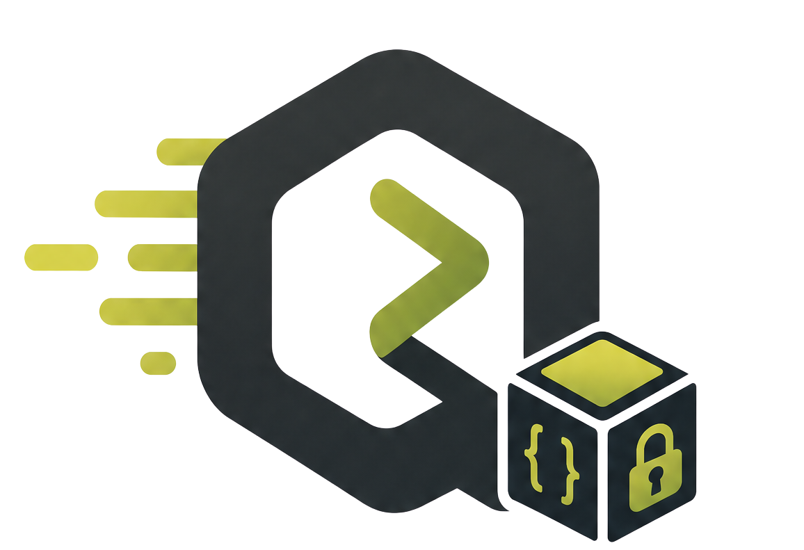

<p align="center">
  
</p>

<h1 align="center">QiloBack</h1>

<p align="center">
  <strong>Backend manufacturer.</strong><br>
  Declare entities, modules and policies in a YAML DSL.<br>
  Compile to a production-grade FastAPI + PostgreSQL backend.
</p>

<p align="center">
  <a href="https://qiloback.dev">Website</a> ·
  <a href="https://app.qiloback.dev">App</a> ·
  <a href="https://github.com/delixon-labs/delixon-qiloback/releases">Releases</a> ·
  <a href="LICENSE">License</a> ·
  <a href="CHANGELOG.md">Changelog</a> ·
  <a href="LICENSE-FAQ.md">License FAQ</a>
</p>

<p align="center">
  <a href="https://www.npmjs.com/package/@qiloback/qiloback"></a>
  <a href="https://pypi.org/project/qiloback-cli/"></a>
  <a href="https://github.com/delixon-labs/delixon-qiloback/releases"></a>
  <a href="LICENSE"></a>
</p>

---

QiloBack reads a single YAML manifest — your entities, your modules, your access policies — and produces a complete FastAPI service: SQLAlchemy models, Pydantic schemas, routers, services, repositories, tests, Alembic migrations, RLS policies, an audit log, realtime change-data-capture, billing wiring, workflows, and typed SDKs.

**The output is yours.** Every project ships with an *Eject* button that hands you the FastAPI source under Apache 2.0 — the QiloBack license stays on the generator, never on the code it writes for you.

**Source-available** under [FSL-1.1-ALv2](LICENSE) — not open source during the first two years of each release. Each version converts to Apache 2.0 two years after release.

## Repositories

QiloBack is split across two repositories:

- **This repository** (`delixon-labs/delixon-qiloback`, public) hosts the installation wrappers (`npm/cli/`, `pip/cli/`), the user-facing documentation, the license, and the compliance files (SECURITY.md, CONTRIBUTING.md, CODE_OF_CONDUCT.md, CHANGELOG.md). Official binaries are published in the [Releases](https://github.com/delixon-labs/delixon-qiloback/releases) tab on this repository.
- **`delixon-labs/qiloback-core`** (private) hosts the source code of the generator, the platform API, the runtime API, the admin panel, the SDKs and the release pipelines. The source is not publicly browsable during the FSL window. For code audits under NDA (enterprise compliance), contact `legal@delixon.dev`.

## Install

### CLI via npm

```bash
npm install -g @qiloback/qiloback
qiloback --version
```

### CLI via pip

```bash
pip install qiloback-cli
qiloback --version
```

The wrapper downloads the native `qiloback` binary for your platform on first install (Windows x64, Linux x64/arm64, macOS x64/arm64), verifies it against the release's `SHA256SUMS`, and caches it under `~/.qiloback/bin/`.

### Direct download

Latest binaries for every supported platform are attached to each tag at [Releases](https://github.com/delixon-labs/delixon-qiloback/releases) along with `SHA256SUMS` for integrity verification.

## Quick start

```bash
qiloback init my-backend           # scaffold a new project from a template
cd my-backend
qiloback validate qiloback.yml     # type-check the manifest
qiloback generate                  # generate FastAPI sources, migrations, tests, SDKs
qiloback up                        # docker compose up — Postgres, Redis, the API
qiloback eject                     # hand off the generated FastAPI source under Apache 2.0
```

The full CLI reference and DSL specification are kept in the private core repository during the FSL window. Public documentation snippets land in [`docs/`](docs/) as features stabilise; the CLI itself ships with `qiloback --help` for every subcommand.

## What QiloBack generates

| Layer            | Output                                                                                                  |
|------------------|---------------------------------------------------------------------------------------------------------|
| Persistence      | SQLAlchemy 2.x models, Alembic migrations, Postgres RLS policies, audit log, soft-delete, optimistic locking |
| API              | FastAPI routers + Pydantic v2 schemas + dependency-injected services and repositories                   |
| Auth             | Email + magic-link, OAuth (Google/GitHub/Apple), passkeys, JWT with rotation, anonymous identities      |
| Modules          | First-party modules — billing (Stripe, Orb), search, AI agents, RAG, file storage, email, push, SMS, i18n, feature flags, A/B tests |
| Realtime         | Change-data-capture over WebSocket with replay tokens                                                   |
| Tests            | Generated pytest suite per entity, contract tests against the OpenAPI schema, hypothesis property tests |
| Observability    | Structlog with `request_id`, OpenTelemetry traces, Prometheus metrics, Sentry-compatible error reporter |
| SDKs             | TypeScript, Python and Dart clients generated from the OpenAPI document                                  |
| Admin panel      | Next.js + Tailwind dashboard with row-level CRUD, audit viewer, feature-flag editor and observability tabs |

## Stack

| Layer       | Technology                                                       |
|-------------|------------------------------------------------------------------|
| Generator   | Python 3.12 · Jinja2 · Pydantic 2 · Click · uv                   |
| Runtime     | FastAPI · SQLAlchemy 2 · Alembic · PostgreSQL 16 · Redis         |
| Admin panel | Next.js 15 · React 19 · TypeScript · Tailwind · Vitest           |
| Distribution| pip (`qiloback-cli`) · npm (`@qiloback/qiloback`) · GitHub Releases |
| Platforms   | Windows · macOS · Linux                                          |

## License

**QiloBack is source-available, not open source.**

Licensed under [FSL-1.1-ALv2](LICENSE) — the Functional Source License with Apache 2.0 Future License. In plain English:

- ✅ Use QiloBack for free — personal, commercial, enterprise, regardless of company size
- ✅ Self-host the platform on your own infrastructure
- ✅ The backends QiloBack generates are **yours** — no QiloBack license attaches to the generated FastAPI code
- ✅ Each version auto-converts to Apache 2.0 **two years** after its release
- ❌ Don't build a commercial product or service that competes with QiloBack itself

See [LICENSE-FAQ.md](LICENSE-FAQ.md) for the full FAQ — enterprise use, private forks, code audits under NDA, why we chose this model, and what happens to your generated backends.

## Security

To report a security issue privately, see [SECURITY.md](SECURITY.md). Do **not** open public issues for vulnerabilities.

## Contributing

Bug reports and PRs against the wrappers, documentation and compliance files in this repository are welcome — see [CONTRIBUTING.md](CONTRIBUTING.md). Contributions to the core happen under an invited-access flow described there.

---

<p align="center">
  <strong>QiloBack</strong> is a product of <a href="https://delixon.dev">Delixon Labs</a><br>
  <sub>Delixon Labs is the developer tools division of <a href="https://xplustechnologies.com">XPlus Technologies LLC</a></sub><br>
  <sub>© 2026 XPlus Technologies LLC. All rights reserved.</sub>
</p>
